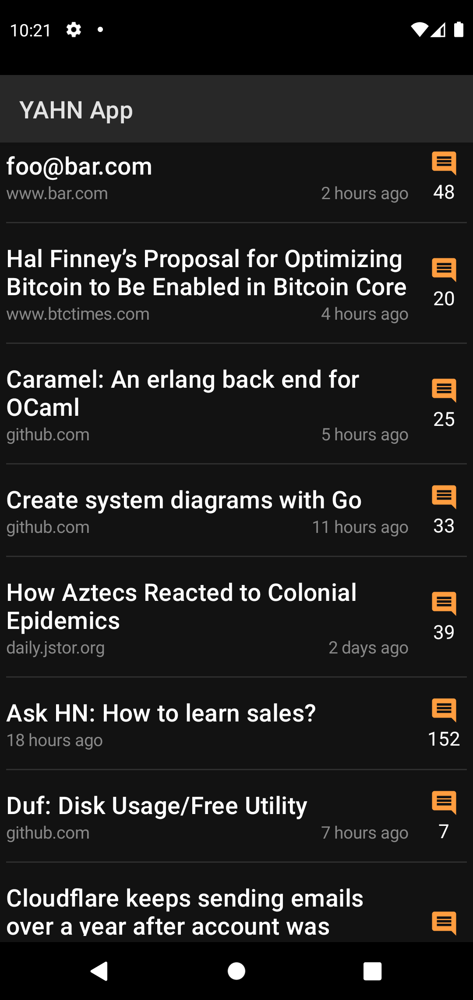

# Yet another Hacker News app (YAHN App)

Yet another Hacker News App is an Android app built using [Jetpack Compose](https://developer.android.com/jetpack/compose). Focus is on privacy, simplicity and performance. YAHN is free as in freedom and always free from advertisements and trackers.

## Why

Why build another Hacker News app, isn't there already several [available](https://play.google.com/store/apps/collection/cluster?clp=ggENCgtoYWNrZXIgbmV3cw%3D%3D:S:ANO1ljLdfVU&gsr=ChCCAQ0KC2hhY2tlciBuZXdz:S:ANO1ljK0-98) in Play Store?

* Modern Android app [targeting](https://github.com/jeremyrempel/yahnapp/blob/603d94abd96727bc1086cb4bed6403b59057fb52/app/build.gradle#L12) the latest version of Android
* Utilizes modern Android libraries and frameworks including:
  * [Jetpack Compose](https://developer.android.com/jetpack/compose)
  * [Kotlin coroutines](https://developer.android.com/kotlin/coroutines)
  * [kotlinx.serialization](https://github.com/Kotlin/kotlinx.serialization)
  * [Ktor](https://github.com/ktorio/ktor)

## What does it look like?

Dark             | Light 
:-------------------------:|:-------------------------:
  |  
  |  